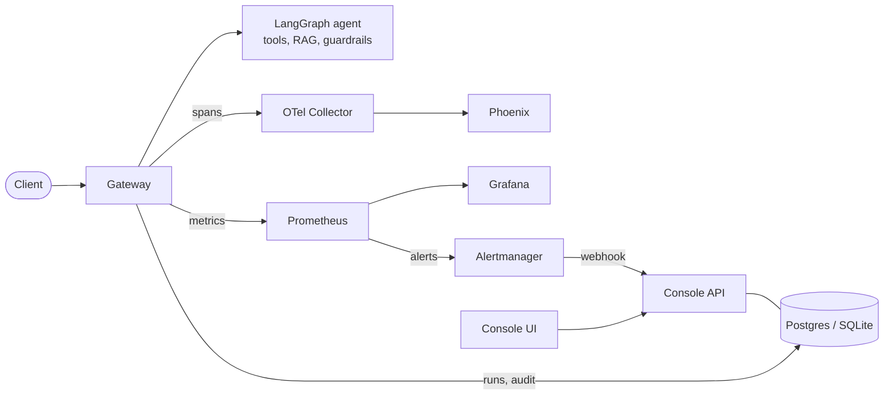

# AgentOps Center

An operations center for production AI agents. It answers the questions a team running agents in
production has to answer: *what is live, is it healthy, what did it do, why did it fail, and can we
reproduce it safely?*

- **Registry and governance:** immutable, versioned agent specs; promote and roll back through
  staging and prod; deployment history; a hash-chained audit trail.
- **Observability:** OpenTelemetry traces for prompts, tool calls and retrieval, a semantic-convention
  standard, Prometheus metrics, a Grafana dashboard and alert rules (success rate, latency, tool
  failure rate, cost per run, loops) defined as code.
- **Incident response:** alerts open incidents with the affected runs attached; triage from a step
  timeline; **deterministic replay** reproduces a failing run with no real model or tool calls;
  **rerun** compares a run against another version.
- **Reliability:** per-call timeouts, retries, circuit breakers, loop detection and fault injection.
- **Responsible AI and FinOps:** PII redaction before anything is traced or stored, prompt-injection
  screening, list-price cost showback by tenant, agent and model.
- **Delivery:** evals as a regression gate in CI, an `aoc` CLI that scaffolds and validates new
  agents, Docker, Helm, kind and GitHub Actions.

Two demo agents built with LangGraph serve a fictional snack company: a supply-chain assistant (RAG,
SQL, tickets) and an HR policy bot (RAG). Everything runs on free tooling.


## See it work in two minutes (no Docker, no API keys)
```bash
uv sync --python 3.12 --extra ui --extra pgvector
export AOC_EMBEDDER=hash AOC_LLM_PROVIDERS=fake AOC_TELEMETRY_ENABLED=false
export AOC_ENABLE_CHAOS_API=true AOC_AUTO_SYNC=true     # demo-only switches

uv run --python 3.12 uvicorn console.api.main:app --port 8001 &
uv run --python 3.12 uvicorn gateway.main:app --port 8000 &
uv run --python 3.12 streamlit run console/ui/app.py &   # console UI on :8501

uv run --python 3.12 python scripts/demo.py               # narrated incident lifecycle
```
The demo runs healthy traffic, breaks a dependency, shows retries and the circuit breaker containing
it, opens an incident, replays the failing run, recovers, and resolves with a root cause. See
[docs/DEMO.md](docs/DEMO.md) for the script and a recorded transcript. To use real models, set
`GOOGLE_API_KEY` and/or `GROQ_API_KEY` (see `.env.example`).

## Measured results
Reproduce with `uv run python scripts/benchmark_resilience.py`; asserted by tests.

| Mechanism | Result |
|---|---|
| Retries (2) at 50% injected tool failure | tool success 51.5% to 88.1% (theory 87.5%) |
| Circuit breaker during a total outage (200 calls) | 600 calls to the failing dependency down to 5 (99.2% avoided) |
| Loop guard, forced loops | stopped in 3 of 3 cases after 2 tool executions |
| Deterministic replay | reproduces tool errors, breaker rejections and loop stops exactly |
| Chunking (supply retrieval, hash embeddings) | heading/fixed MRR 0.938 vs paragraph 0.812 |

The chunking numbers use a small judged set and an offline embedder; they show the method. Details in
[docs/BENCHMARKS.md](docs/BENCHMARKS.md).

## Architecture
See [docs/ARCHITECTURE.md](docs/ARCHITECTURE.md) for diagrams.



## Status
| Area | State |
|---|---|
| Runtime, registry, console, gateway, incidents, replay, FinOps, guardrails, evals, CLI | built and unit tested; the core flows were also run against live local servers |
| Dockerfile, compose, Helm chart, kind config, GitHub Actions, AKS scripts | written and statically checked; **not yet run** (needs Docker, kind, helm, GitHub, Azure) |
| Traces in Phoenix, Grafana dashboard live, pgvector on Postgres | need the Docker stack; configuration is in place |

Known limits (details in the ADRs in `docs/adr/`): no schema migrations yet; PII detection is
pattern-based and does not find person names; the deterministic eval baseline guards regressions but
does not measure real answer quality; there is no authentication on the console or gateway; fault
injection and circuit-breaker state are per process.

## Quality gates
```bash
uv run --python 3.12 ruff check .      # lint
uv run --python 3.12 aoc validate      # onboarding rules for every agent
uv run --python 3.12 pytest            # unit, integration and static checks
uv run --python 3.12 aoc eval --check  # eval regression gate
```

## More
| | |
|---|---|
| `docs/ARCHITECTURE.md` | diagrams, components, what changes in production |
| `docs/DEMO.md` | two-minute demo script and transcript |
| `docs/DEPLOY.md` | docker compose, Kubernetes (kind), CI/CD |
| `infra/aks/README.md` | optional Azure deployment, cost and teardown |
| `docs/ONBOARDING.md` | add an agent with `aoc new-agent` |
| `docs/SEMCONV.md` | trace and metric conventions |
| `docs/RUNBOOK.md` | alert playbooks and the triage workflow |
| `docs/RESPONSIBLE_AI.md` | guardrails, audit trail, and their limits |
| `docs/BENCHMARKS.md` | reliability benchmarks |
| `docs/adr/` | architecture decision records |

## License
MIT, see [LICENSE](LICENSE).
