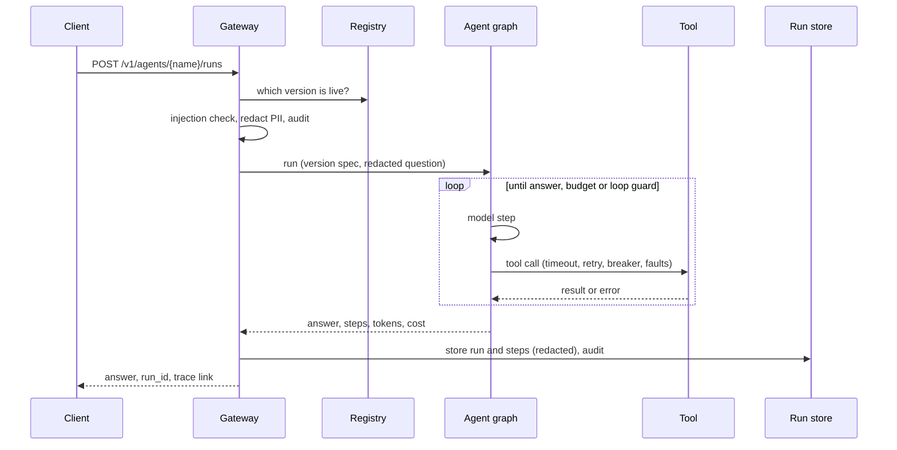

# Architecture

AgentOps Center has two halves: the **runtime** that executes agents safely and emits telemetry, and
the **operations center** that lets people see, triage, replay and govern what the agents did.

## System view

```mermaid
flowchart LR
    client([Client or eval job]) --> gw

    subgraph runtime [Agent runtime]
        gw[Gateway<br/>FastAPI]
        guard[Guardrails<br/>injection check, PII redaction]
        graph[LangGraph agent<br/>model, tools, RAG]
        res[Resilience<br/>timeout, retry, circuit breaker,<br/>loop guard, fault injection]
        gw --> guard --> graph --> res
    end

    subgraph ops [Operations center]
        api[Console API<br/>FastAPI]
        ui[Console UI<br/>Streamlit]
        db[(Postgres or SQLite<br/>registry, runs, steps,<br/>incidents, audit)]
        api --- db
        ui --> api
    end

    subgraph obs [Observability]
        otel[OTel Collector]
        phoenix[Phoenix<br/>traces]
        prom[Prometheus]
        am[Alertmanager]
        graf[Grafana<br/>dashboards]
    end

    gw -- "spans (OTLP)" --> otel --> phoenix
    gw -- "/metrics" --> prom --> graf
    prom -- alert rules --> am -- webhook --> api
    gw -- "runs, steps, audit" --> db
    gw -. "served version" .-> api
```

- The gateway serves whichever agent **version** the registry says is live, so promotion and rollback
  change behaviour without a redeploy.
- Every run is stored with its steps. `run_id` is the OpenTelemetry `trace_id`, so a run record, its
  trace, its audit entry and any incident all share one identifier.

## One request



## Incident lifecycle

```mermaid
flowchart LR
    f[Failure or latency in a tool] --> m[Metrics change]
    m --> r[Alert rule fires]
    r --> w[Webhook to console]
    w --> i[Incident opened<br/>exemplar runs attached]
    i --> t[Triage in UI:<br/>step timeline, trace link]
    t --> p[Deterministic replay<br/>reproduces the failure]
    p --> x[Fix as new agent version]
    x --> e[Eval gate in CI]
    e --> d[Promote in registry]
    d --> v[Rerun replay on new version<br/>to confirm]
    v --> c[Resolve with root cause]
```



## Components

| Path | Responsibility |
|---|---|
| `aoc_runtime/` | graph loop, telemetry setup and conventions, metrics, loop guard, resilience, fault injection, guardrails, cost, replay primitives |
| `agents/` | agent specs (`agent.yaml`), prompts and tools; one folder per agent |
| `rag/` | chunking strategies, embeddings, local and pgvector stores |
| `gateway/` | serves runs: version resolution, guardrails, recording, admin chaos toggle |
| `console/` | registry, run history, incidents, replay, FinOps, audit; API and Streamlit UI |
| `evals/` | datasets and the regression-gated eval runner |
| `cli/` | `aoc` command: scaffold, validate, eval, register, chaos, replay |
| `deploy/` | Dockerfile, compose stack, Helm chart, kind config, Prometheus, Alertmanager, Grafana as code |
| `infra/aks/` | optional Azure deployment scripts |
| `.github/workflows/` | CI, evals, release, manual AKS deploy |

## Design decisions
See `docs/adr/` for the reasoning behind the main choices and their trade-offs.

## Trace and metric conventions
See `docs/SEMCONV.md`. Metrics never carry `run_id` as a label (unbounded cardinality); traces and the
run store do.

## What would change in production
- Replace the optional single Postgres with a managed, backed-up database and add migrations (the
  dev setup uses `create_all`).
- Put authentication and per-tenant authorization in front of the console and gateway; today they
  trust the network.
- Export telemetry to the organisation's backend (Azure Monitor or another OTLP endpoint) by changing
  only the Collector exporter; add a Collector redaction processor as a second PII layer.
- Use a pull-based GitOps controller for deployment and managed secrets (Key Vault) instead of
  Helm values.
- Add a person-name-capable PII detector (an NER model) and a stronger prompt-injection classifier.
- Run several gateway replicas: fault injection and circuit-breaker state are per process today.
