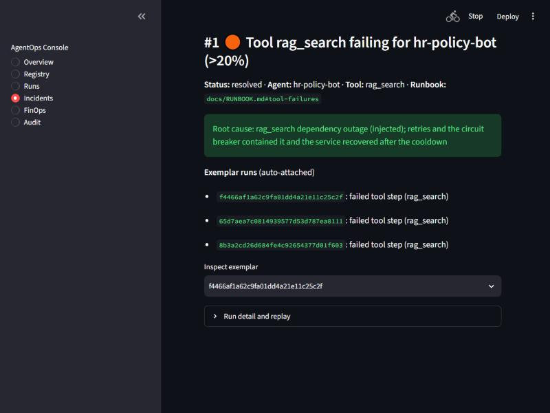
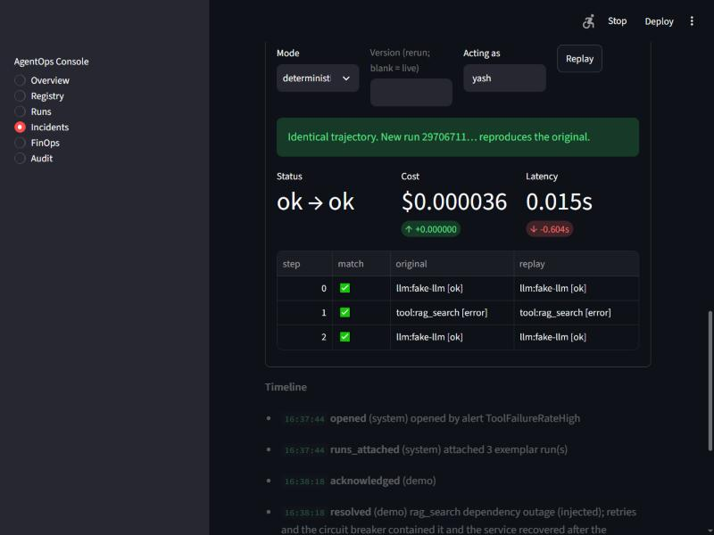

# Demo

A two-minute walkthrough of the incident lifecycle. It is scripted (`scripts/demo.py`), so it is the
same every time and safe to rehearse.

## Run it
```bash
# three processes, no Docker, no API keys (see the README for the env vars)
uv run python scripts/demo.py
```
With the full stack (Prometheus and Alertmanager running) pass `--no-simulate-alert --wait-for-alert 90`
and the alert arrives by itself. Otherwise the demo posts an Alertmanager-shaped webhook.

For a recording: open the console UI on the Incidents page, start a screen recorder, then run the
script in a terminal beside it.

## Script and talking points
| # | What happens | What to say |
|---|---|---|
| 1 | Registry sync, version 1.0.0 goes live | Versions are immutable and promoted through staging to prod; the gateway serves whatever is live. |
| 2 | Healthy traffic | Baseline: every tool call succeeds. |
| 3 | The retrieval tool starts failing | Retries absorb some failures; after five consecutive failures the circuit breaker opens, so we stop hammering the dependency and fail fast. The agents still answer. |
| 4 | An incident opens | The alert hit the webhook; the incident already has the affected runs attached and a link to the runbook. |
| 5 | Triage | The step timeline shows the first failing step and its error: the cause is one click away, and the trace id ties to the trace. |
| 6 | Deterministic replay | Re-drive the run from its recording: no real model or tool calls, no side effects, same trajectory, excluded from production metrics. |
| 7 | The dependency recovers | The breaker stays open until its cooldown, then probes; the demo waits for it to close. |
| 8 | Rerun | Same question, live, to confirm the fix. For a code or prompt fix this is where you compare versions. |
| 9 | Resolve | Resolving requires a root cause; the timeline keeps the history. |
| 10 | Audit | The hash chain verifies. |

## Recorded transcript
See [img/demo-transcript.txt](img/demo-transcript.txt) for the real output of a run.

## Screenshots



## Questions the demo invites
- *Why not just retry forever?* Retries fix transient faults; against a hard outage they multiply the
  load. The benchmark in `docs/BENCHMARKS.md` shows 600 calls to the dependency without a breaker
  versus 5 with it.
- *Can I trust a replay?* It reproduces what was recorded, which is how you debug safely. It does not
  say what a new prompt would do; the rerun mode is for that. See `docs/adr/0004`.
- *Where is the PII?* Redacted before the model, traces and storage; see `docs/RESPONSIBLE_AI.md`.
